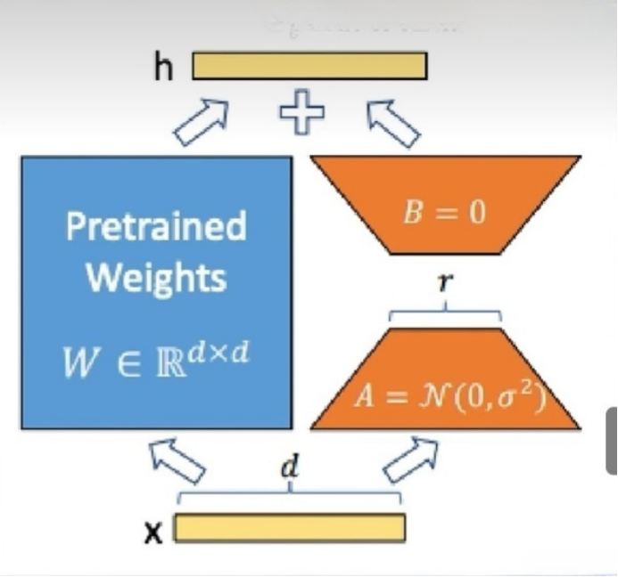
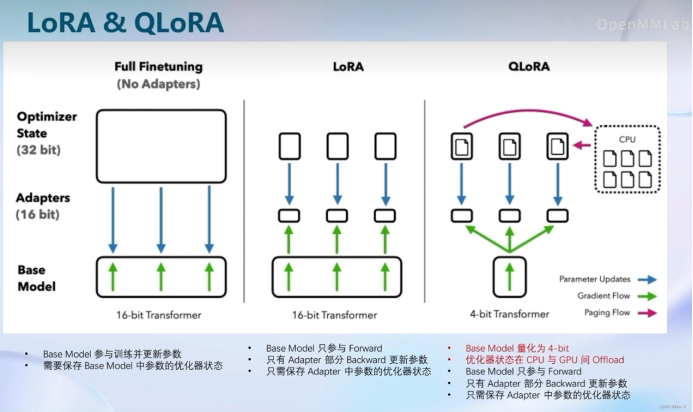
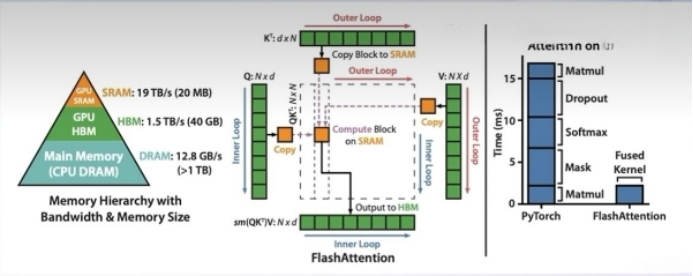
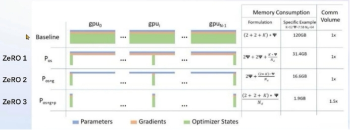

# XTUNER及其微调原理介绍

## 一.xtuner介绍

### 1. 高效的数据引擎

XTuner 适配了多个热门开源数据集格式，开发者如已有对应格式的数据集，可以直接使用，并支持多种格式数据源的混合使用：

Alpaca 格式，斯坦福大学开源数据集的格式，也是社区开源项目使用较多的一种格式

MOSS 格式，复旦大学开源指令微调数据集的格式，包含多轮对话和工具调用

Gunacao 格式，QLoRA 项目中所使用数据集的格式

OpenAI 格式，GPT-3.5-Turbo Finetune 接口要求的数据集格式

### 2. 多种训练引擎 

XTuner 首次尝试将 HuggingFace 与 OpenMMLab 进行结合，兼顾易用性和可配置性。支持使用 MMEngine Runner 和 HuggingFace Trainer 两种训练引擎，开发者如有深度定制化需求，可根据使用习惯灵活配置。

 ```
 pip install xtuner
 
 # 使用 MMEngine Runner 训练
 xtuner train internlm_7b_qlora_oasst1_e3
 
 # 使用 HugingFace Trainer 训练
 xtuner train internlm_7b_qlora_oasst1_e3_hf
 ```

### 3. 一键启动训练 

XTuner 内置了增量预训练、单轮&多轮对话指令微调、工具类指令微调的标准化流程，让开发者只需聚焦于数据本身。

同时， XTuner 集成了 QLoRA、DeepSpeed 和 FSDP 等技术，提供各种尺寸模型在各种规格硬件下的训练解决方案，通过XTurner一键式启动训练，仅需8GB显存即可微调7B模型。

 ```
 pip install 'xtuner[deepspeed]'
 # 8G 显存微调 Llama2-7B
 xtuner train llama2_7b_qlora_oasst1_512_e3 --deepspeed deepspeed_zero2
 ```

## 二.微调原理

### 1. LORA的原理

   LoRA通过在原本的Linear旁，新增一个支路，包含两个连续的小Linear,新增的这个支路通常叫做Adapter（LORA）
   Adapter参数量远小于原本的 Linear，能大幅降低训练的显存消耗。

 

### 2. 三种模式的对比Full Finetuning、LoRA、QLoRA

 

### 3. XTuner两个优化技巧Flash Attention和 DeepSpeedZeRO

1. Flash Attention

​    Flash Attention将Attention计算并行化,避免了计算过程中Attention Score NxN的显存占用(训练过程中的N都比较大)。

 

2. DeepSpeed ZeRO：

​     ZeRO优化，通过将训练过程中的参数、梯度和优化器状态切片保存,能够在多GPU训练时显著节省显存，除了将训练中间状态切片外，DeepSpeed 训练时使用FP16的权重,相较于Pytorch的AMP训练，在单GPU上也能大幅节省显存。

 ```
 其并非自动启动需要加 --deepspeed deepspeed zero3
 
 QLoRA后面加上  --deepspeed deepspeed zero2
 
 xtuner train internlm_20b_qlora__oasst1_512_e3  --deepspeed deepspeed zero3
 ```


 